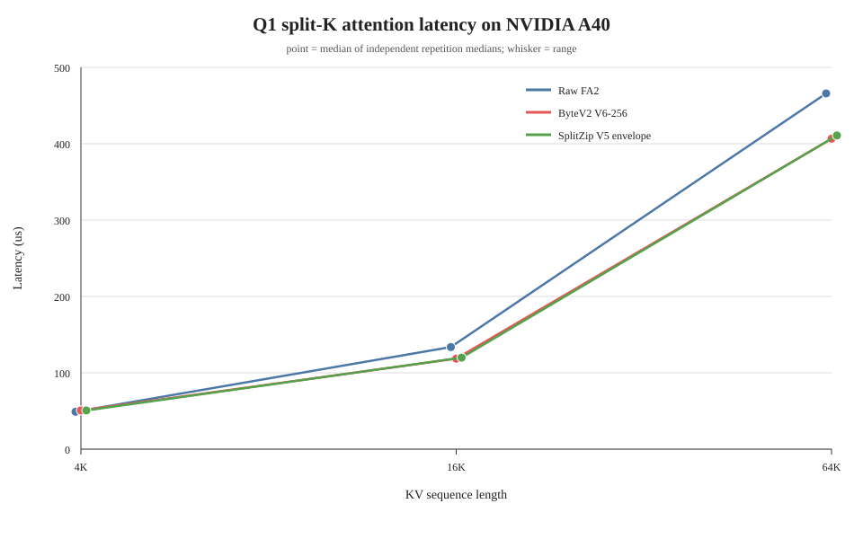
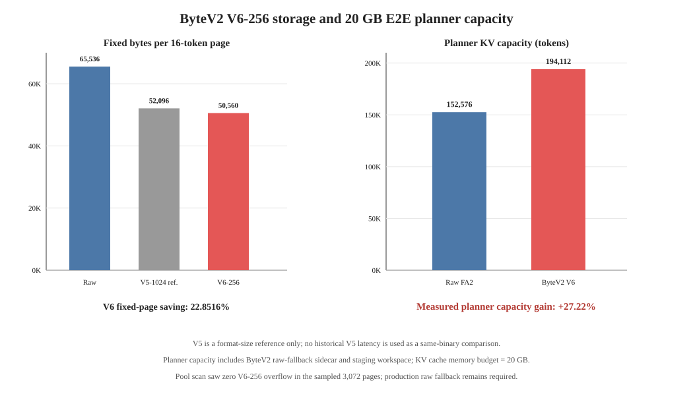

# ByteV2 V6-256 FA2 实验报告

**实现：** ByteV2 V6 固定页（256-entry outlier pool）接入 FA2
`flash_fwd_splitkv` 路径

**GPU：** NVIDIA A40，84 SM，CC 8.6

**Nsight Compute：** 2025.4.1

**日期：** 2026-07-27

**实验目录：** `profile/bytev2-v6-256-fa2-a40-20260727/`

## 结论

V6-256 达到了这一轮的主要目标：在保留 V5 dense payload 与 metadata ABI、
保留 hybrid authoritative raw fallback 的前提下，将固定 compact page 从
52,096 B 缩小到 50,560 B。相对 65,536 B 的 raw BF16 page，固定页节省
22.8516%；相比 V5，每页再减少 1,536 B。

本轮没有观察到正确性回退。隔离 FA2 对比中，ByteV2 V6 的 output 与 LSE
相对 raw FA2 均为 bitwise 一致；65K context、128 output token 的 E2E ABBA
四次请求生成了完全相同的 128 个 token。

性能结论需要分层理解：

- CUDA-event 隔离 attention 测试中，V6 在 4K 时约慢 3%，在 16K 和 65K
  时分别快约 11.3% 和 12.7%。这说明短序列仍由 decode/metadata 固定开销
  主导，长序列开始兑现 DRAM 流量下降。
- 65K E2E ABBA 中，raw TPOT 为 40.184/40.217 ms，V6 为
  38.149/38.176 ms，V6 平均约低 5.07%。但 V6 的平均 TTFT 仍高约 1.13%，
  所以本次单组 ABBA 的整请求时间基本持平，而不是整体吞吐显著领先。
- 20 GB KV-cache planner 给 raw 152,576 token、V6 194,112 token，V6
  容量增加 27.22%。历史 V5 为 188,432 token；V6 再增加 5,680 token，
  即 3.01%。
- NCU 中 raw/V6 的 DRAM read 为 299.619/241.886 MB，下降 19.27%；
  achieved occupancy 从 8.44% 提升到 15.55%，long-scoreboard ratio 从
  4.578 降到 2.487。V6 同时引入更多 decode、shared-memory 和非合并
  metadata/outlier 访问，因此 DRAM 节省不会一比一转化成 kernel 延迟。

V6-256 的主要新增价值是容量，不是相对 V5 的 reader 延迟。未使用的 pool
尾部本来就不在 attention 热读路径中；历史 V5 NCU 的 DRAM read 为
242.148 MB，本轮 V6 为 241.886 MB，仅少 0.108%。历史 V5 与本轮 V6
不是同一 binary，二者只能用于判断数量级，不能作为严格的格式 A/B。





## 1. 实验设置

### 1.1 固定页格式

每个 page 含 16 token、8 KV head、head dimension 128，并同时存储 K/V：

| 格式 | Metadata | Dense payload | Pool | Page bytes | 相对 raw 节省 |
| --- | ---: | ---: | ---: | ---: |
| Raw BF16 | — | — | — | 65,536 | 0% |
| ByteV2 V5-1024 | 896 B | 49,152 B | 2,048 B | 52,096 | 20.5078% |
| **ByteV2 V6-256** | 896 B | 49,152 B | 512 B | **50,560** | **22.8516%** |

V6-256 没有更改 dense payload 编码和 tile metadata 结构，只缩小固定
outlier pool。SplitZip reader 仍显式使用 V5-1024 的 52,096 B page，
没有跟随 ByteV2 默认页大小变化。

### 1.2 隔离 attention

`harness/benchmark_three_way.py` 让 raw、ByteV2 V6 和固定页 SplitZip
经过同一组 FA2 参数。工作负载为 Q1、8 KV head、head dimension 128；
4K/16K/65K 分别使用 16/19/20 split。输入来自 Llama layer-0 BF16 K/V
capture，并重复到目标长度。

每个 repetition 包含 12 次 warmup、60 个 CUDA-event sample，每个
sample 内连续调用 20 次再除以 20；三种 backend 按六种排列轮换，以降低
固定执行顺序的偏差。4K、16K 各采集 5 个 repetition，65K 采集 10 个。

### 1.3 E2E

模型为本地 Llama-3.1-8B-Instruct，batch size 1，context 65,536，
生成 128 token，关闭 speculative decoding 与 prefix caching，使用 compiled
模式，KV-cache planner 预算 20,000,000,000 B。执行顺序为
raw → V6 → V6 → raw（ABBA）。E2E 中 `num_splits=0`，因此它和
65K/20-split 的隔离测试不是同一个 dispatch 配置。

ByteV2 E2E 使用 hybrid authoritative raw fallback。该安全协议要求先保留
可用的 raw sidecar，再发布 compact page；不能用 compact-only writer
的 fail-closed/trap 行为替代生产 fallback。当前 production planner 和
engine workspace binder 均会拒绝没有显式设置
`BYTE_V2_FA2_HYBRID_RAW_FALLBACK=1` 的 V6 配置；低层 legacy decoder
若独立遇到无 embedded raw payload 的 fallback tile，也会直接 trap，
不会继续用无效 compact 数据静默计算。

### 1.4 NCU

NCU 对 65K、Q1、20-split 的 raw 与 V6 主 kernel 各采集一次 full + PM
sampling 和一次 SourceCounters。两个 launch 均为 grid 160、block 128。
原始报告位于 [`reports/`](reports/)，抽取结果位于
[`analysis/`](analysis/)。

## 2. 正确性与安全门

| 检查 | 结果 |
| --- |
| 4K/16K/65K V6 output vs raw | 0 bit mismatch |
| 4K/16K/65K V6 LSE vs raw | 0 bit mismatch |
| 65K NCU harness output/LSE | 0 bit mismatch |
| 65K E2E 四次请求 token | 128/128 完全一致 |
| SplitZip V5 pressure/ragged/permuted/shared-prefix regression | 0 mismatch |
| E2E hybrid fatal | 0 |
| V6 planner/binder 缺少 authoritative raw fallback | 正确拒绝 |
| Legacy compact fallback tile | subprocess fail-closed |
| Sideband-high V5 writer 与 V6 错页长输入 | 正确通过 / 正确拒绝 |
| 完整 `test_byte_v2_layout.py` | 403 passed，1 skipped |

SplitZip 的单独回归结果见
[`splitzip_v5_regression_gate.json`](reports/splitzip_v5_regression_gate.json)。

两次 V6 E2E 的 sidecar 状态均为 1,536 slot 中 1,504 free，
`raw_page_count=32`。这 32 个 raw page 对应 32 层各一个 mutable raw tail，
不是 outlier pool overflow。生产正确性仍依赖 hybrid raw fallback；样本中
没有 overflow 不代表可以删除 fallback。

## 3. CUDA-event attention 性能

下表用各 repetition 的 median 表示范围；“差距”定义为
`V6 / raw - 1`：

| Seq len | Split | Raw median | V6 median | V6 vs raw |
| ---: | ---: | ---: | ---: |
| 4,096 | 16 | 48.717–49.715 µs | 50.278–51.123 µs | +2.57%～+3.47% |
| 16,384 | 19 | 133.683–133.734 µs | 118.426–118.733 µs | -11.18%～-11.45% |
| 65,536 | 20 | 465.741–466.048 µs | 406.272–407.142 µs | -12.61%～-12.83% |

65K 的 10 次 repetition 中，V6 的归一化收益稳定在约 12.7%。历史 V5
同一类 harness 的 3 次 65K 结果为 -12.61%～-12.82%，与 V6 基本相同。
这支持“缩短未使用 pool 尾部不影响 reader 热路径”的判断，但由于历史 V5
不属于当前 binary，不能把微小绝对时间差解释为 V6 格式收益。

隔离结果文件见
[`reports/event_s4096_split16_rep1.json`](reports/event_s4096_split16_rep1.json)、
[`reports/event_s16384_split19_rep1.json`](reports/event_s16384_split19_rep1.json)
和
[`reports/event_s65536_split20_rep1.json`](reports/event_s65536_split20_rep1.json)；
其余 repetition 使用同一命名规则。

## 4. E2E 结果

TPOT 按每个请求的 `decode_seconds / 127` 计算：

| 顺序 | Backend | TTFT | TPOT | Engine E2E | Capacity |
| --- | --- | ---: | ---: | ---: |
| A | raw FA2 | 22.081 s | 40.184 ms | 27.181 s | 152,576 token |
| B | ByteV2 V6 | 22.657 s | 38.149 ms | 27.498 s | 194,112 token |
| C | ByteV2 V6 | 22.866 s | 38.176 ms | 27.711 s | 194,112 token |
| D | raw FA2 | 22.932 s | 40.217 ms | 28.037 s | 152,576 token |

四次请求的 `performance_valid_for_tps` 均为 true，preemption 均为 0，
生成 token 完全一致。平均 TPOT 从 raw 的 40.201 ms 降至 V6 的
38.162 ms，下降 5.07%；平均 TTFT 从 22.506 s 增至 22.761 s，
增加 1.13%。只有一个 ABBA block，TTFT 的这个差异不能视为稳定估计，
但足以说明本轮没有解决长 prompt 的 prefill 开销。

在 20 GB 预算下：

| Planner | Blocks | Capacity | 相对 raw |
| --- | ---: | ---: |
| Raw | 9,536 | 152,576 token | — |
| 历史 V5 | — | 188,432 token | +23.50% |
| **V6-256** | **12,132** | **194,112 token** | **+27.22%** |

V6 planner 数字已经包含 compact tensor、authoritative raw fallback
sidecar 和 raw staging workspace，不是只用 `20 GB / 50,560 B` 得到的
理想容量。V6 相对 V5 增加 5,680 token（3.01%）。

原始 E2E JSONL 位于
[`reports/e2e_production/`](reports/e2e_production/)。

## 5. NCU 分析

### 5.1 Headline metrics

NCU duration 受 replay/采集影响，不能替代上一节的 CUDA-event 延迟：

| Metric | Raw | V6 | 解释 |
| --- | ---: | ---: |
| NCU duration | 460.576 µs | 444.608 µs | 仅作结构参照 |
| SM throughput | 33.55% | 34.56% | 接近 |
| DRAM read throughput | 93.56% | 78.25% | V6 降低带宽压力 |
| DRAM read | 299.619 MB | 241.886 MB | -19.27% |
| L1 hit rate | 0.41% | 48.32% | V6 访问混入 metadata/decode 数据 |
| L2 hit rate | 0.42% | 66.62% | 同上 |
| Tensor-pipe active | 33.55% | 34.56% | QK/PV 主体仍保留 |
| Registers/thread | 252 | 250 | 无明显变化 |
| Shared memory/block | 82,944 B | 51,072 B | V6 可驻留 2 CTA/SM |
| Theoretical occupancy | 8.33% | 16.67% | 约 2 倍 |
| Achieved occupancy | 8.44% | 15.55% | 约 1.84 倍 |
| Waves/SM | 1.905 | 0.952 | V6 约一轮双 CTA 驻留覆盖 grid |
| Long-scoreboard ratio | 4.578 | 2.487 | global-memory 等待下降 |
| Short-scoreboard ratio | 0.149 | 0.794 | decode/shared 依赖上升 |
| Local load/store | 0 / 0 | 0 / 0 | 无 register spill |

完整并列表见
[`compare_raw_vs_v6.txt`](analysis/compare_raw_vs_v6.txt)。

### 5.2 Occupancy 与 launch geometry

raw 的 82,944 B shared memory 使每个 SM 只能驻留一个 CTA，因此 160 个
CTA 在 84 SM 上需要约 1.905 waves。V6 的 51,072 B shared memory 允许
每 SM 两个 CTA，160 CTA 小于 84×2，因而 `waves/SM=0.952`。这里较小的
waves 数不是 occupancy 退化，而是一个近满的双 CTA residence wave。

V6 achieved occupancy 达 15.55%，但仍很低；250 registers/thread 和 FA2
的 warp 结构共同限制可用 warp。增加 occupancy 不是无条件目标，后续改动
需要同时观察实际 issue-active、shared traffic 和 bitwise gate。

### 5.3 Stall 与 source hotspot

raw 的主要 long-scoreboard hotspot 位于常规 FA2 KV load/mainloop：
`utils.h:330` 3,799 samples、`flash_fwd_kernel.h:1117` 3,264 samples、
`flash_fwd_kernel.h:1076` 1,580 samples。

V6 将这类等待分散到 FA2 mainloop 和 ByteV2 loader：

- `flash_fwd_kernel.h:1073`：1,641 long-scoreboard samples；
- `flash_fwd_kernel.h:1112`：1,576；
- `byte_v2_fa2_loader.cuh:729`：805；
- `byte_v2_fa2_loader.cuh:651`：779；
- `byte_v2_fa2_loader.cuh:1005`：502；
- `byte_v2_fa2_loader.cuh:148`：731 short-scoreboard samples。

V6 的 aggregate long-scoreboard ratio 从 4.578 降到 2.487，但
short-scoreboard 从 0.149 升到 0.794，符合“少读 DRAM、增加本地 decode
依赖”的实现变化。逐行数据见
[`stall_hotspots_raw.txt`](analysis/stall_hotspots_raw.txt) 和
[`stall_hotspots_v6.txt`](analysis/stall_hotspots_v6.txt)。

NCU scheduler rule 还将 V6 的 no-eligible-warp 问题给出 20.81% 的局部
estimated speedup。该数字是规则对单个限制因素的上界估算，不是
CUDA-event 或 E2E 收益预测，也不能和其他 rule estimate 相加。

### 5.4 Timeline 与 load balance

PM sampling 采到了 stall 时间序列，但本次报告没有可用的
`sm__throughput`、active-warps 或 DRAM-throughput PM instance，因此不能
从该报告定量声称某个 tail speedup。raw 和 V6 的 stall 在主要 active
区间持续存在，图见
[`pm_timeline_plots.txt`](analysis/pm_timeline_plots.txt)。

本次 isolated workload 是固定 65K、固定 split 的单请求，不覆盖生产中的
variable-length batch load imbalance。

### 5.5 Memory access

V6 将 DRAM read 降低 57.732 MB，但没有达到固定页 22.8516% 的同等比例，
因为 kernel 还包含 query、metadata、outlier、输出和其他 FA2 流量。
NCU rule 同时报告 V6 global load 的 uncoalesced 比例为 35.89%，shared
store bank-conflict 比例为 38.97%；SourceCounters 将 excessive global
sectors 标为 46.53%，shared wavefronts 标为 44.32%。

这些规则混合了 FA2 swizzle 和 ByteV2 decode 访问，NCU 的局部估算不能
直接相加或当作可兑现的 E2E speedup。它们应当作为下一轮定位
`metadata/payload load → shared reconstruction` 的方向，而不是立即改动
原始 FA2 QK、softmax、PV、split/combine 顺序的理由。

## 6. 诊断与下一步

| 优先级 | 方向 | 数据依据 | 目标 |
| ---: | --- | --- |
| 1 | 保留 V6-256 + hybrid fallback，扩大 pool-demand 验证分布 | 当前仅单模型 B1 capture；零 overflow 不能证明全集安全 | 先保证生产 fail-safe |
| 2 | 优化 loader 的 metadata/outlier gather 和 shared reconstruction | V6 loader 多处 long/short-scoreboard hotspot；NCU 报告非合并访问与 bank conflict | 降低 4K 的约 3% 回退，并扩大长序列收益 |
| 3 | 单独 profile prefill writer/prepare 路径 | 65K E2E 平均 TTFT 仍高约 1.13%，整请求时间未改善 | 将 TPOT 收益扩展到整请求 |

V6-256 不需要为了容量目标再改 QK、softmax、PV 或原始 FA2 combine。
对 reader 的下一轮优化必须继续以 raw FA2 output/LSE bitwise gate 和 E2E
token gate 为硬约束。

## 7. 置信度与限制

- 可以确认：V6 page 为 50,560 B；固定页节省 22.8516%；本轮隔离与 E2E
  正确性 gate 全部通过；20 GB planner 容量为 194,112 token。
- 可以确认：在本轮 isolated shapes 上，4K 有固定开销回退，16K/65K
  有稳定 CUDA-event 收益；NCU 确认 DRAM read 下降而 decode/shared 依赖
  上升。
- 不能确认：单次 NCU replay duration 是否代表稳定事件延迟；应以
  CUDA-event repetitions 为准。
- 不能确认：V6 相对 V5 的细小 latency/NCU 差异。历史 V5 来自不同
  binary，期间 loader 代码和 register count 也发生变化。
- 当前 capture 只覆盖一个 Llama-3.1-8B、batch 1、自然文本样本；没有覆盖
  code、多语言、长上下文自然分布、多 batch 或 decode-tail pool demand。
- direct compact-only path 在 pool overflow 或 fallback tile 上会
  fail-closed/trap，不能提供 production availability。production planner
  和 binder 已强制绑定 authoritative raw fallback，不能根据本轮零
  overflow 删除 sidecar。

## 8. 复现

完整说明见 [`harness/README.md`](harness/README.md)。下面列出与报告产物
参数一致的核心命令。

### CUDA-event（示例 repetition 1）

```bash
cd /mnt/sdb/yxz/ByteV2/vllm
CUDA_VISIBLE_DEVICES=0 .venv/bin/python \
  profile/bytev2-v6-256-fa2-a40-20260727/harness/benchmark_three_way.py \
  --seq-len 65536 --query-len 1 --num-splits 20 \
  --warmup 12 --iterations 60 --calls-per-sample 20 --repetition 1 \
  --output profile/bytev2-v6-256-fa2-a40-20260727/reports/event_s65536_split20_rep1.json
```

### E2E ABBA

```bash
cd /mnt/sdb/yxz/ByteV2/vllm
CUDA_VISIBLE_DEVICES=0 \
  profile/bytev2-v6-256-fa2-a40-20260727/harness/run_production_abba.sh \
  1 128 \
  profile/bytev2-v6-256-fa2-a40-20260727/reports/e2e_production
```

### NCU full + PM sampling

```bash
cd /mnt/sdb/yxz/ByteV2/vllm
/usr/local/cuda/bin/ncu \
  --profile-from-start off --target-processes all --set full \
  --section PmSampling --section PmSampling_WarpStates \
  --kernel-name 'regex:.*flash_fwd_splitkv_byte_v2_kernel.*' \
  --launch-count 1 \
  --export profile/bytev2-v6-256-fa2-a40-20260727/reports/full_v6_bytev2_s65536_q1 \
  .venv/bin/python \
  profile/bytev2-v6-256-fa2-a40-20260727/harness/profile_main_kernel.py \
  --backend bytev2 --seq-len 65536 --num-splits 20 --warmup 8
```

raw 使用同一命令，将 kernel regex 改为
`.*flash_fwd_splitkv_kernel.*`、backend 改为 `raw`、输出改为
`full_raw_s65536_q1`。SourceCounters 采集将 `--set full` 和两个 PM
section 替换为 `--set source --section SourceCounters`。
